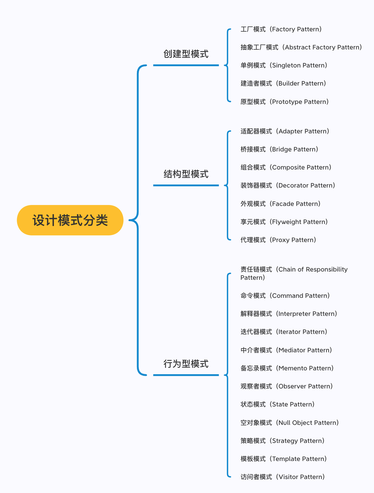

# 开坑原因

最近接触了一些前端，发现很许多人都对设计模式不了解(我也是)，特此开坑欢迎大家一起从前端的视角来学习设计模式，希望这个系列可以帮助到大家在工作中写出优秀的代码。

**我希望这个系列的可以达成的目标**

1. 熟悉常用的设计模式及前端实现
2. 了解每种设计模式对应解决了哪些问题，有哪些优缺点

# 什么是设计模式

> **设计模式（Design pattern）代表了最佳的实践**，通常被有经验的面向对象的软件开发人员所采用。设计模式是软件开发人员在软件开发过程中面临的一般问题的解决方案。这些解决方案是众多软件开发人员经过相当长的一段时间的试验和错误总结出来的。
>
> 设计模式是一套被反复使用的、多数人知晓的、经过分类编目的、代码设计经验的总结。**使用设计模式是为了重用代码、让代码更容易被他人理解、保证代码可靠性。** 毫无疑问，设计模式于己于他人于系统都是多赢的，设计模式使代码编制真正工程化，设计模式是软件工程的基石，如同大厦的一块块砖石一样。项目中合理地运用设计模式可以完美地解决很多问题，每种模式在现实中都有相应的原理来与之对应，每种模式都描述了一个在我们周围不断重复发生的问题，以及该问题的核心解决方案，这也是设计模式能被广泛应用的原因

上面这段话是我网上抄来的，加上个人理解是

1. 设计模式是前辈们对一类问题解决方案的反复实践和总结出的最佳实践（精华）
2. 使用设计模式使得代码易复用，易理解，可靠性高
3. 进阶高级码农需要掌握的知识技能
4. 面试必备

# 设计模式的三大分类和六大原则

## 设计模式的三大分类
根据设计模式的参考书 **《设计模式 - 可复用的面向对象软件元素》** 提到的，总共有 23 总设计模式。这些模式可以分为三大类

### 创建型模式
 - 工厂模式（Factory Pattern）
 - 抽象工厂模式（Abstract Factory Pattern）
 - 单例模式（Singleton Pattern）
 - 建造者模式（Builder Pattern）
 - 原型模式（Prototype Pattern）

### 结构型模式
 - 适配器模式（Adapter Pattern）
 - 桥接模式（Bridge Pattern）
 - 组合模式（Composite Pattern）
 - 装饰器模式（Decorator Pattern）
 - 外观模式（Facade Pattern）
 - 享元模式（Flyweight Pattern）
 - 代理模式（Proxy Pattern）

### 行为型模式
 - 责任链模式（Chain of Responsibility Pattern）
 - 命令模式（Command Pattern）
 - 解释器模式（Interpreter Pattern）
 - 迭代器模式（Iterator Pattern）
 - 中介者模式（Mediator Pattern）
 - 备忘录模式（Memento Pattern）
 - 观察者模式（Observer Pattern）
 - 状态模式（State Pattern）
 - 空对象模式（Null Object Pattern）
 - 策略模式（Strategy Pattern）
 - 模板模式（Template Pattern）
 - 访问者模式（Visitor Pattern）

### 这些设计模式之间的关系如下

## 设计模式的六大原则

### 1. 开闭原则（Open Close Principle）

开闭原则的意思是：对扩展开放，对修改关闭。在程序需要进行拓展的时候，不能去修改原有的代码，实现一个热插拔的效果。简言之，是为了使程序的扩展性好，易于维护和升级。想要达到这样的效果，我们需要使用接口和抽象类，后面的具体设计中我们会提到这点。

### 2. 里氏代换原则（Liskov Substitution Principle）

里氏代换原则是面向对象设计的基本原则之一。 里氏代换原则中说，任何基类可以出现的地方，子类一定可以出现。LSP 是继承复用的基石，只有当派生类可以替换掉基类，且软件单位的功能不受到影响时，基类才能真正被复用，而派生类也能够在基类的基础上增加新的行为。里氏代换原则是对开闭原则的补充。实现开闭原则的关键步骤就是抽象化，而基类与子类的继承关系就是抽象化的具体实现，所以里氏代换原则是对实现抽象化的具体步骤的规范。

### 3. 依赖倒转原则（Dependence Inversion Principle）

这个原则是开闭原则的基础，具体内容：针对接口编程，依赖于抽象而不依赖于具体。

### 4. 接口隔离原则（Interface Segregation Principle）

这个原则的意思是：使用多个隔离的接口，比使用单个接口要好。它还有另外一个意思是：降低类之间的耦合度。由此可见，其实设计模式就是从大型软件架构出发，便于升级和维护的软件设计思想，它强调降低依赖，降低耦合。

### 5. 迪米特法则，又称最少知道原则（Demeter Principle）

最少知道原则是指：一个实体应当尽量少地与其他实体之间发生相互作用，使得系统功能模块相对独立。

### 6. 合成复用原则（Composite Reuse Principle）

合成复用原则是指：尽量使用合成/聚合的方式，而不是使用继承。

## 总结

这一节是对设计模式做了一个简单的介绍，以及设计模式的三大分类和六大原则。后面每一节将介绍一种设计模式及其实现，敬请期待。

