# UML 类图

在介绍 23 种设计模式之前需要简单说明下一些相关概念，方便后面提到其他设计模式时能够快速理解。

UML 类图是解释类的基础以及各个类之间关系的图。

## 类图基础属性

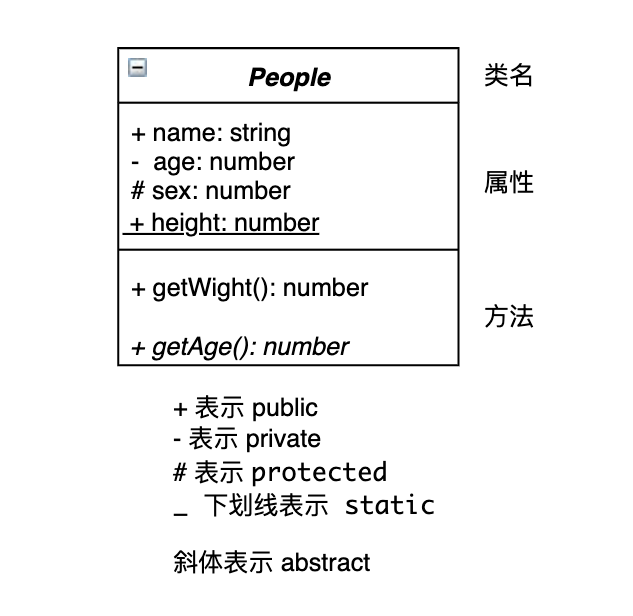

### + 表示 public

public 可以修饰属性或者方法，被 public 修饰的属性或方法只可以被类本身、子类、实例等使用。

```typescript
class People {
  public name = "people"

  getName() {
    return this.name;
  }
}

class Bob extends People {
  getName() {
    return this.name;
  }
}

new People().name;   // "people"
new Bob().name;      // "people"
new Bob().getName(); // "people"
```

### - 表示 private

private 可以修饰属性或者方法，被 private 修饰的属性或方法只可以被类本身使用。

```typescript
class People {
  private name = "people"
  getName() {
    return this.name;
  }
}

class Bob extends People {
  getName() {
    return this.name; // TSError: 属性“name”为私有属性，只能在类“People”中访问
  }
}

new People().name;    // TSError: 属性“name”为私有属性，只能在类“People”中访问。
```
### # 表示 protected

protected 可以修饰属性或者方法，被 protected 修饰的属性或方法只可以被类本身、子类使用。

```typescript
class People {
  protected name = "people"
  protected getName() {
    return this.name;
  }
}

class Bob extends People {
  getName2() {
    return this.getName();
  }
}

new People().name;      // TSError: 属性“name”受保护，只能在类“People”及其子类中访问。
new People().getName(); // TSError: 属性“getName”受保护，只能在类“People”及其子类中访问。
new Bob().name;         // TSError: 属性“name”受保护，只能在类“People”及其子类中访问。
new Bob().getName();    // TSError: 属性“getName”受保护，只能在类“People”及其子类中访问。
new Bob().getName2();   // "people"
```

### _ 下划线表示 static

static 可以修饰属性或者方法，用来表示静态属性或静态方法，被 static 修饰的方法只可以在类未实例化时使用。

```typescript
class People {
  static name = "people"

  static getName() {
    return this.name;
  }
}
People.name;         // "people"
People.getName();    // "people"
new People().name    // TSError: 属性“name”在类型“People”上不存在。
new People().getName();  // TSError: 属性“getName”在类型“People”上不存在。
```

### 斜体表示 abstract

abstract 只可以修饰方法或类，用来表示抽象方法，该修饰符只能在抽象类中使用，且被修饰的方法不能由该抽象基类实现，必须由其派生类实现。注意抽象类无法实例化。

```typescript
abstract class People {
  name = "people"
  abstract getName(): string
}

class Bob extends People {
  getName() {
    return this.name;
  }
}

new Bob().getName();   // "people"
new People();          // TSError: 无法创建抽象类的实例。
```

## 类之间的关系

在UML类图中，常见的有以下几种关系:
 - 依赖(Dependency)
 - 关联(Association)
 - 聚合(Aggregation)
 - 组合(Composition)
 - 继承(Generalization)
 - 实现(Implementation)

### 依赖关系(Dependency)

> 依赖关系是一种使用关系，特定事物的改变有可能会影响到使用该事物的其他事物，在需要表示一个事物使用另一个事物时使用依赖关系。可以简单的理解，就是一个类A使用到了另一个类B，而这种使用关系是具有偶然性的、临时性的、非常弱的，但是B类的变化会影响到A比如人要开车 `drive`，人需要使用到车的 `move` 方法，但是并不在乎车子的一些属性，只要能开就行。


UML 图中用下面这种方式表示**依赖关系**


```typescript
class Car {
  move() {
    // ...
  }
}

class People {
  drive(car: Car) {
    car.move();
  }
}

const people = new People();
const car = new Car();

people.drive(car);
```

用 UML 类图表示为

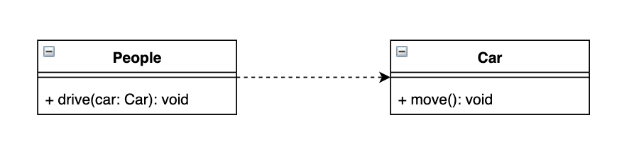

### 关联关系(Association)

> 关联关系的定义为：对于两个相对独立的对象，当一个对象的实例与另一个对象的一些特定实例存在固定的对应关系时，这两个对象之间为关联关系。它体现的两个类中一种强依赖关系，比如出租车司机和汽车，这种关系比依赖更强，不存在依赖关系中的偶然性，关系也不是临时的，一般是长期性的。

UML 图中用下面这种方式表示**关联关系** (如果是双向关联关系可以省略箭头)，当然还有自关联，如节点类(Node)的成员又是节点 Node 类型的对象

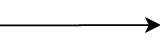

```typescript
class Car {
  move() {
    // ...
  }
}

class Driver {
  car: Car = new Car()

  move() {
    this.car.move();
  }
}

```

用 UML 类图表示为

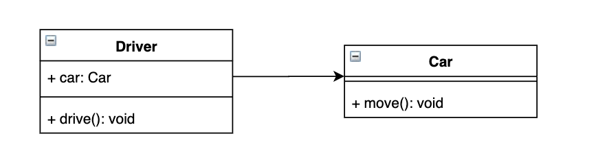

### 聚合关系(Aggregation)

>聚合关系是关联关系的一种，耦合度强于关联，他们的代码表现是相同的，仅仅是在语义上有所区别：关联关系的对象间是相互独立的，而聚合关系的对象之间存在着包容关系，他们之间是“整体-个体”的相互关系，聚合关系中作为成员变量的类一般使用 set 方法赋值。

UML 图中用下面这种方式表示**聚合关系**

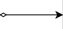

```typescript
class Engine {
  // ...
}
class Car {
  engine: Engine;
  setEngine(engine: Engine) {
    this.engine = engine;
  }
}
```

用 UML 类图表示为

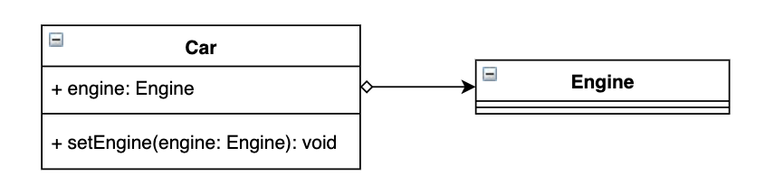

### 组合关系(Composition)

> 组合关系也表示类之间整体和部分的关系，但是在组合关系中整体对象可以控制成员对象的生命周期，一旦整体对象不存在，成员对象也将不存在，成员对象与整体对象之间具有同生共死的关系。在UML中，组合关系用带实心菱形的直线表示。例如：人的头(Head)与嘴巴(Mouth)，嘴巴是头的组成部分之一，而且如果头没了，嘴巴也就没了，因此头和嘴巴是组合关系

UML 图中用下面这种方式表示*组合关系*

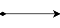

```typescript
class Mouth {
  // ...
}
class Head {
  mouth: Mouth = new Mouth();
}
```


用 UML 类图表示为

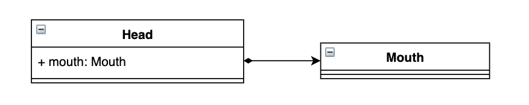

### 继承关系(Generalization)

> 用于描述父类与子类之间的关系，父类又称作基类或超类，子类又称作派生类。在UML中，泛化关系用带空心三角形的直线来表示

UML 图中用下面这种方式表示*继承关系*

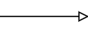

```typescript
class People {
  name: string;
  age: number;
}

class Student extends People {
  studentNo: number;
  study: () => void;
}

class Teacher extends People {
  teacherNo: number;
  teach: () => void;
}
```

用 UML 类图表示为

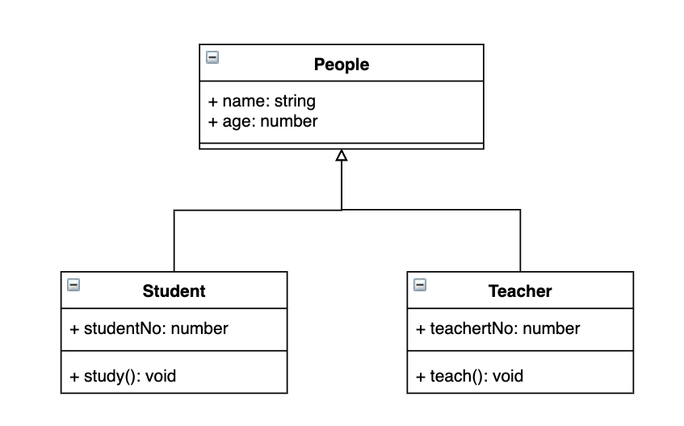

### 实现关系(Implementation)

>接口之间也可以有与类之间关系类似的继承关系和依赖关系，但是接口和类之间还存在一种实现关系，在这种关系中，类实现了接口，类中的操作实现了接口中所声明的操作。在UML中，类与接口之间的实现关系用带空心三角形的虚线来表示。例如：定义了一个 Peple，包含一个抽象操作 say()，在类 Student 和类 Teacher 中都实现了该 say()操作，不过具体的实现细节将会不一样

UML 图中用下面这种方式表示*实现关系*

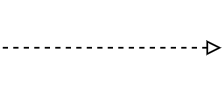

```typescript
interface People {
  say: () => void;
}

class Student implements People {
  say() {
    console.log("Student");
  }
}

class Teacher implements People {
  say() {
    console.log("Teacher");
  }
}
```

用 UML 类图表示为

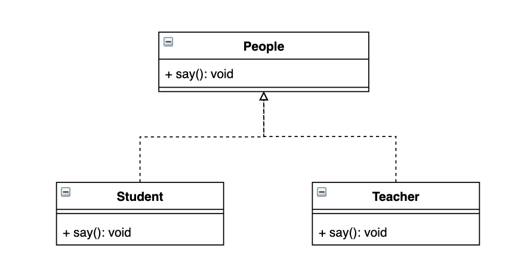
